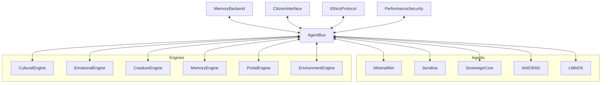

# 🏛️ Eden One Architecture Documentation

## 🌌 System Overview

### 🧠 Central Brain & Multi-Agent Integration
- **AthenaMist-Blended**: Unified AI brain for all city systems.
- **Agent Bus**: Secure, event-driven communication between AthenaMist, Serafina, Sovereign Core, AINCRAD, and LilithOS agents.
- **Plug-and-Play Modules**: All engines implement a standard interface for dynamic orchestration.
- **Memory Backend**: Redis/Mistral support for scalable, smart feedback loops.
- **Citizen Interface**: Multimodal input (voice, gesture, neural, XR, HUD).
- **Ethical Protocols**: Transparent, auditable, and override-ready AI decision hooks.
- **Performance & Security**: Real-time metrics and audit logging.
- **Spatial Integration**: Native support for AINCRAD spatial engine.
- **OS Integration**: Designed for LilithOS distributed operations.

### Core Architecture Components

#### 1. Emotional Intelligence Engine (EIE)
- **Purpose**: Manages and processes emotional interactions between humans, creatures, and the environment
- **🧠 Brain Integration**: Real-time emotional processing with AthenaMist-Blended
- **Components**:
  - Emotional Resonance Detector (Brain-enhanced)
  - Biofeedback Processing Unit (Brain-optimized)
  - Emotional State Analyzer (Brain-coordinated)
  - Response Generation System (Brain-managed)

#### 2. Earth Culture Cradle (ECC)
- **Purpose**: Maintains and evolves Earth's cultural heritage with intelligent preservation
- **🧠 Brain Integration**: Cultural significance analysis and exhibition optimization
- **Components**:
  - Cultural Database (Brain-enhanced)
  - Exhibition Sphere Controller (Brain-optimized)
  - Cultural Evolution Engine (Brain-coordinated)
  - Ambassador Program Manager (Brain-managed)

#### 3. Love Creature Haven (LCH)
- **Purpose**: Manages bioengineered creatures and their emotional bonds with humans
- **🧠 Brain Integration**: Creature-human bonding optimization and health monitoring
- **Components**:
  - Creature Manager (Brain-enhanced)
  - Emotional Bond Analyzer (Brain-optimized)
  - Health Monitor (Brain-coordinated)
  - Behavioral Pattern Analyzer (Brain-managed)

#### 4. Zero-G Environment Control (ZEC)
- **Purpose**: Manages zero-gravity environments and therapeutic floating gardens
- **🧠 Brain Integration**: Therapeutic environment optimization and garden management
- **Components**:
  - Environment Controller (Brain-enhanced)
  - Garden Manager (Brain-optimized)
  - Life Support System (Brain-coordinated)
  - Therapeutic Index Calculator (Brain-managed)

#### 5. Temptation Stargate (TS)
- **Purpose**: Manages advanced resonance testing and portal activation
- **🧠 Brain Integration**: Resonance analysis and portal activation optimization
- **Components**:
  - Resonance Tester (Brain-enhanced)
  - Portal Controller (Brain-optimized)
  - Access Control System (Brain-coordinated)
  - Sacred Protocol Manager (Brain-managed)

#### 6. Coastal Memory Engine (CME)
- **Purpose**: Manages therapeutic coastal memories and emotional experiences
- **🧠 Brain Integration**: Memory optimization and therapeutic experience management
- **Components**:
  - Memory Database (Brain-enhanced)
  - Experience Manager (Brain-optimized)
  - Therapeutic Analyzer (Brain-coordinated)
  - Sensory Processor (Brain-managed)

## 🔄 System Interactions

### Emotional Biome Gardens
```
[Human] → [EIE + Brain] → [Environment]
   ↑          ↓
[Creatures] ← [Brain-Enhanced Emotional Feedback]
```

### Earth Culture Cradle
```
[Human] → [ECC + Brain] → [Exhibition Sphere]
   ↑          ↓
[Ambassador] ← [Brain-Optimized Cultural Feedback]
```

### Love Creature Haven
```
[Human] → [LCH + Brain] → [Creatures]
   ↑          ↓
[Emotional Bond] ← [Brain-Coordinated Biofeedback]
```

### Zero-G Connection Dome
```
[Human] → [ZEC + Brain] → [Environment]
   ↑          ↓
[Flora/Fauna] ← [Brain-Managed Zero-G Adaptation]
```

### The Temptation Stargate
```
[Human] → [TS + Brain] → [Portal]
   ↑          ↓
[Resonance] ← [Brain-Enhanced Security Protocol]
```

### Coastal Memory Engine
```
[Human] → [CME + Brain] → [Memory Experience]
   ↑          ↓
[Therapeutic Impact] ← [Brain-Optimized Sensory Feedback]
```

## 🛡️ Security Architecture

### Access Control
- Multi-layer authentication system with brain verification
- Emotional resonance verification with brain analysis
- Cultural preservation clearance with brain validation
- Ambassador status validation with brain coordination
- Sacred access protocols with brain management

### Data Protection
- Quantum encryption for sensitive data with brain oversight
- Emotional data anonymization with brain protection
- Cultural heritage preservation protocols with brain monitoring
- Bioengineering safety measures with brain coordination
- Memory data privacy with brain protection

## 🔄 System Integration

### Communication Protocols
- Quantum-entangled communication with brain coordination
- Emotional resonance channels with brain optimization
- Cultural preservation networks with brain enhancement
- Bioengineering control systems with brain management
- Portal operations with brain intelligence

### Data Flow
- Real-time emotional feedback with brain processing
- Cultural evolution tracking with brain analysis
- Environmental adaptation data with brain optimization
- Security clearance verification with brain validation
- Memory experience data with brain optimization

## 📈 Scalability

### System Expansion
- Modular architecture design with brain coordination
- Emotional intelligence scaling with brain optimization
- Cultural database growth with brain management
- Environmental adaptation capacity with brain enhancement
- Memory system expansion with brain coordination

### Performance Optimization
- Emotional processing efficiency with brain optimization
- Cultural data management with brain enhancement
- Environmental control optimization with brain coordination
- Security protocol enhancement with brain management
- Memory processing optimization with brain coordination

## 🔍 Monitoring and Maintenance

### System Health
- Emotional resonance monitoring with brain analysis
- Cultural preservation tracking with brain oversight
- Environmental parameter control with brain optimization
- Security protocol verification with brain validation
- Memory system health with brain monitoring

### Maintenance Protocols
- Regular emotional calibration with brain coordination
- Cultural database updates with brain optimization
- Environmental system checks with brain validation
- Security protocol reviews with brain oversight
- Memory system maintenance with brain coordination

## 🧠 Brain Integration Features

### Unified Intelligence
- Single brain controlling all systems
- Real-time coordination across all subsystems
- Predictive optimization and anticipatory responses
- Adaptive learning from system interactions
- Intelligent resource allocation and management

### Enhanced Capabilities
- Real-time emotional processing and analysis
- Cultural significance analysis and optimization
- Advanced creature-human bonding optimization
- Therapeutic environment management and optimization
- Sophisticated resonance testing and portal control
- Memory experience optimization and therapeutic management

### Fallback Systems
- Graceful degradation when brain is unavailable
- Independent operation of all subsystems
- Robust error handling for brain communication
- Status monitoring and reporting
- Performance tracking and optimization

## 🧩 Modular System Diagram



## 🔗 Integration Points
- **AINCRAD**: Real-time spatial modeling, visualization, and planning. Agents communicate via AgentBus.
- **LilithOS**: Secure, distributed OS for running city modules as services. Agents communicate via AgentBus.

## 🛠️ Example: Agent-to-AINCRAD Data Flow
```python
from src.eden_core.agent_bus import AgentBus, Agent
aincrad_agent = Agent('AINCRAD', public_key='...')
bus = AgentBus()
aincrad_id = bus.register_agent(aincrad_agent)
bus.send_message(sender_id=aincrad_id, recipient_id=..., message={'zone_update': ...})
```

## 📚 Cross-References
- See `/docs/security/SECURITY_PROTOCOLS.md` for security and OS integration.
- See `/docs/specifications/EMOTIONAL_INTELLIGENCE.md` for interface and agent logic.
- See `/docs/cultural/CULTURAL_PRESERVATION.md` for cultural engine and spatial integration.

---
*This architecture document is classified under NovaSanctum.Orbitals.EdenOne security protocols.*
**🧠 Powered by AthenaMist-Blended - The Central Brain of Eden One** 